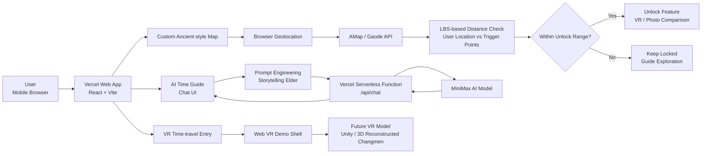

## 1. Project Motivation & Pre-research

### Project Motivation

Changmen is a vital transportation hub and landmark in Suzhou, carrying a profound historical and cultural heritage. With urban development, its architectural style has evolved, and its function as a hub has diminished. Following multiple renovations, it now differs significantly from its original appearance.

Today, tourists face several pain points: excessive renovation has obscured its original charm, while cultural communication remains tedious and lacks engaging interaction, making it difficult to evoke cultural empathy.

### Competitive Analysis

（这里我找了四张竞品照片，你到时候可以每一个竞品文字旁边都有一个照片，方便参考）

#### “Hang Xiaoyi” Intelligent Agent

**Strengths**

- It integrates Hangzhou’s attractions, transportation, accommodation, and other city-wide tourism resources, allowing users to complete travel planning and service queries in one place.

- Its government-enterprise operation model is mature, with authoritative information and data that can support urban cultural tourism management.

- It can generate personalized travel routes based on users’ interests and available travel time.

**Weaknesses**

- The 3D digital human appears visually rough, with stiff facial expressions and body movements.

- Its cultural explanation is more suitable for general city tourism, but lacks depth for a specific ancient building such as Changmen.

- Its interaction mainly relies on text or voice Q&A and information search, lacking gamified or playful interaction.

#### Liangzhu Large-Space VR Experience

**Strengths**

- It uses official archaeological data to accurately reconstruct Liangzhu Ancient City at a high level of detail.

- It provides a strong immersive experience through large-space VR, motion capture, and narrative design.

- It explains archaeological knowledge in a gamified way, making it suitable for families and educational visitors.

**Weaknesses**

- It requires dedicated offline venues and VR headsets, creating a high access threshold and relatively high cost.

- The experience route is fixed and linear, with limited personalization and little support for free exploration.

- Development and operation costs are high, including venue construction, hardware purchasing, maintenance, and content updates.

#### Lvji Guide

**Strengths**

- It covers a very wide range of attractions, including major scenic spots and smaller local sites.

- It supports GPS-triggered audio explanations, combining recorded voice, historical materials, stories, hand-drawn maps, and navigation.

- It supports multiple platforms such as apps and mini programs, and can also be used offline.

**Weaknesses**

- The content is often standardized and lacks depth for individual sites such as Changmen.

- The product is heavily commercialized, with frequent advertisements and many paid features.

- It mainly relies on pre-recorded audio and static maps, without AI interaction or personalized explanation.

#### Suzhou Museum AI Assistant “Xiao Susu”

**Strengths**

- It is based on official museum materials, so the explanation content is professional and reliable.

- It provides different explanation styles for general visitors, children, and educational users.

- It supports basic museum visit needs such as entry consultation, relic explanation, and cultural product recommendations.

**Weaknesses**

- It is limited to indoor museum scenarios and cannot adapt to Changmen’s outdoor open-site environment.

- Its interaction is mainly basic Q&A, lacking gamified check-ins, tasks, or playful exploration.

- It passively waits for user questions and lacks active route guidance or personalized visit planning.

After analyzing these four products, we found that existing products are often mature and intelligent, but large-scale products usually lack specificity. Therefore, we decided to avoid direct competition and create a small but refined product specifically for Suzhou Changmen.

## Requirement Discovery
### interview

We conducted initial in-depth interviews with two typical users: one tourist and one local resident.

Preliminary user pain points were identified as follows: excessive renovations have deprived Changmen of its original look; cultural dissemination is dull and lacks engaging interaction, making it difficult to arouse people’s cultural empathy.

We then communicated with cultural tourism influencer Teacher Yangmian. While affirming the existing pain points, the expert also analyzed the structure of his followers and pointed out two core stakeholder groups:

The first group is **architecture students**. They strongly hope to combine theoretical book knowledge with real architectural scenes and gain first-hand exposure to ancient architecture on site.

The second group is **new residents of Suzhou**. Most of them hold annual scenic area passes and have visited local attractions many times. They are no longer satisfied with superficial sightseeing and long for more in-depth and interesting cultural interpretations.
这里配上5张采访照片，名字为面试1-5号。

### **User Story**
（这里每个用户都有一个形象照片，分别叫，第一个用户，第二个用户）
#### （建筑系学生，dongzizi）(核心用户)

- **Background:** An undergraduate architecture student with deep knowledge of ancient architecture and its underlying cultural significance. This is her first visit to Suzhou, making a special trip to explore the ancient architecture of Changmen. However, upon arrival, she is deeply disappointed: the newly rebuilt Changmen has lost its original ancient charm due to multiple renovations, making it unrecognizable from its historical state. Furthermore, the lack of professional historical materials and architectural explanations on-site leaves her with a profound sense of frustration.

**Core Objectives**

- Research the historical background of Changmen and experience the construction aesthetics of its ancient architecture.
- Obtain precise, professional, and intelligent explanations that decode ancient architectural structures.
- Utilize VR technology to restore the architectural model of Changmen from the Ming and Qing dynasties, allowing for an immersive experience of its past prosperity and providing a reference for her professional studies.

**Current Pain Points**

- Because the newly rebuilt Changmen has undergone multiple renovations, its past magnificence has not been well preserved.
- The site lacks professional historical references and in-depth architectural explanations, failing to meet her professional research needs.

#### User Persona 2: New Suzhou Resident & Father (Zou Tianyu)  (次要用户)**

**User Story**

- **Background:** A 35-year-old hardware engineer and father of a 6-year-old girl. Having been busy with his career for years, he has neglected spending time with his family. As a "New Suzhou Resident" who has settled in the city, he hopes to make up for his absence and increase his companionship during his daughter's childhood now that his job is stable. He plans to take her to various attractions across Suzhou to learn about local history and culture. However, knowing very little about the historical allusions and cultural stories of sites like Changmen, he is completely unable to provide vivid explanations for his daughter, struggling with superficial "check-in" style sightseeing.

**Core Objectives**

- Tour Suzhou's attractions with his daughter, helping her understand the city's history and culture to achieve high-quality parent-child companionship.
- Access lightweight, easy-to-understand historical and cultural explanations to quickly grasp the stories and heritage of the attractions.
- Leverage gamified parent-child features like "Tracking Old Photo Locations" to keep the child engaged through adventure, achieving "learning through play" while allowing him to reminisce about his youth and deepen the father-daughter bond.

**Current Pain Points**

- As a non-native resident lacking historical and cultural knowledge reserves, he cannot explain the stories and cultural significance behind the attractions to his daughter.
- Merely "checking in" at tourist spots is too tedious and fails to meet the needs for deep parent-child companionship and cultural education.

### Questionnaire Survey: Supplementary Verification

We conducted a questionnaire survey to verify the user pain points identified in interviews, as well as to confirm whether users approve of our corresponding solutions to each pain point. In total, we collected 50 valid questionnaires.

（这里表格复用，之前的FIG. 01 — TOURIST PAIN POINTS SURVEY (N=46)和FIG. 02 — FUNCTION PREFERENCES (N=46, 5-POINT SCALE)。不过表格里的文字内容要改成英文的）

### User Journey Map

|**旅程阶段**|**用户具体行为**|**情绪状态**|**核心痛点**|**我们产品的解决方式**|
|---|---|---|---|---|
|抵达现场|初次参观阊门，想要欣赏古建筑之美|期待转为失落|翻新改动大，古韵缺失，与历史印象落差明显|VR 还原明清阊门原貌，直观呈现古今差异|
|现场游览|漫步景区观赏城楼建筑，想了解历史背景|好奇但茫然|现场缺少专业讲解，建筑与历史典故难以理解|提供AI Guidance服务。并利用提示词工程，对内容进行优化，使其回答更有针对性|
|中途游玩|闲逛打卡拍照，但苦于没什么活动。并想要知道过去这里的人们是怎么生活的|无趣、疑惑|观光形式单一枯燥。没有良好展示过往人文的方式|寻找老照片拍摄地，增加游玩趣味性。抵达地方，可以进行新老照片对比|
|游玩结束|离开景区，回忆游览过程|印象零散、容易淡忘|走马观花，没有深刻文化收获与记忆点|保留解锁后的照片和VR功能，让游客可以回味游览记忆|

### Implementing Playfulness：

In this system, “Playful” refers to a lightweight gamified cultural experience. Its focus is to stimulate users’ interest in exploration through a variety of enjoyable services, transforming the experience from passively reading information about Changmen into actively discovering its history and spatial changes.

1.- The system must transform cultural learning from passive reading into active exploration. Users should be able to actively discover Changmen-related historical content through map interaction, location-based triggers, and guided experiences, rather than only browsing static text or images.

2.- The system must provide visually engaging presentation and interactive feedback. The overall appearance, page design, and core functions should be visually attractive. At the same time, the system should provide clear and immediate feedback after users complete key actions.

3.- The system must provide curiosity-driven and enjoyable services, such as an AI guide, draggable historical photo comparison, and location unlocking. These features should encourage users to continue asking questions, exploring, and experiencing the system. The overall experience may include lightweight gamification, but it should not turn the cultural experience into a full game.

## Ideation & Alternative Solutions.

### Crazy Eights Sketch

We adopted the Crazy Eights sketching method for brainstorming. Through this approach, we completed the initial exploration of UI design directions and discussed the logic of page transitions.
.
（这里放置一个8个我的草图。照片名字叫做草图1-8）

### Design Alternatives

**1. Time-Travel Experience Technology Route**

**Option A: AR-Triggered Experience** 

Users trigger historical content through a mobile camera at a fixed location or in front of a recognizable object, such as a stone tablet, city gate, or information board. Cultural relics or architectural models could also be overlaid onto the real environment to create an interactive mixed-reality experience.

**Problems / Limitations:** 

AR is more suitable for displaying a single cultural relic or a partial model. However, in this project, there is no highly representative single object that can carry the whole experience. AR also requires handling issues such as recognition stability, lighting conditions, model scale, phone angle, and device compatibility, which would increase development and testing costs.

**Option B: VR Immersive Experience** 

Users enter a historical Changmen scene reconstructed as closely as possible based on available materials. The first-person view can be adjusted in real time through sensors such as the gyroscope.

**Reason for Selection:** 

Visual impact comes first. VR is more suitable for presenting a complete historical scene and creating a stronger visual impression. In addition, a more accurately reconstructed VR model has greater value for learning and reference. Compared with AR, VR is more suitable for quickly presenting the core experience during the demo stage.

---

**2. Map Implementation Technology Route**

**Option A: Real LBS Map** 

Directly integrate a real map service such as AMap, using real roads, positioning, and POI-triggering capabilities for navigation and exploration.

**Problems / Limitations:** 

There are many modern residential areas, commercial buildings, and ordinary road details around Changmen, which could weaken the historical atmosphere and make users feel disconnected from the ancient-style experience. The default map style is also too modern and does not match the product’s visual design. We considered customizing the map style, but deep customization requires a paid plan, costing about 3,000 RMB per year.

**Option B: Customized Stylized Map** 

Keep the basic road structure, but weaken or hide modern buildings. Redesign the map with an ancient-style visual language, and add markers such as flags and city towers.

**Reason for Selection:** 

Visual design comes first. A customized map gives us full control over the visual style and information hierarchy, making it more consistent with the product’s ancient-style theme. It can serve not only as a navigation tool, but also as a foundation for future interactions, mini-games, and exploration routes.

---

**3. AI Guide Technology Route**

**Option A: RAG-Based Knowledge Base Q&A** 

Build a Changmen knowledge base by uploading historical photos, books, ancient texts, attraction descriptions, and other materials, allowing the AI to retrieve relevant information before answering user questions.

**Problems / Limitations:** 

RAG can reduce AI hallucination, but it requires a longer development cycle. It involves organizing materials, splitting text, building a vector database, semantic retrieval, and answer generation. For the demo stage, the development difficulty is relatively high.

**Option B: Prompt Engineering + Character-Based AI** 

Use prompt engineering to define the AI’s identity, tone, and explanation style, allowing it to act as a “storytelling elder” who provides themed guidance for users.

**Reason for Selection:** 

This solution has a lower development cost and can quickly align with the Changmen cultural theme while still preserving a personalized AI experience. In the future, it can be expanded to support user-customized guide characters or be connected to a RAG knowledge base to improve factual accuracy.

**Development Process**

### Early-stage Product

During development, the coding team first built a quick functional prototype, while the UI designer worked on more refined interface designs. Feedback from the early prototype was then used to guide later UI iterations. In this way, the prototype and the visual design improved together through continuous feedback.。

（可以放置两个链接点击，然后我配置了两个照片可以帮助作为封面）

这是我们初期产品的链接：

[阊门时空穿越](https://changmen-gate-time-travel-project.vercel.app/)

这里是我们的figma交互链接。

[https://www.figma.com/proto/4y0GgePx5MkKhXxndP2cq3/208%E6%9C%80%E5%90%8E%E6%88%90%E5%93%81?node-id=1-2&t=6AgoaskyHp48A4EW-1&scaling=scale-down&content-scaling=fixed&page-id=0%3A1&starting-point-node-id=1%3A2](https://www.figma.com/proto/4y0GgePx5MkKhXxndP2cq3/208%E6%9C%80%E5%90%8E%E6%88%90%E5%93%81?node-id=1-2&t=6AgoaskyHp48A4EW-1&scaling=scale-down&content-scaling=fixed&page-id=0%3A1&starting-point-node-id=1%3A2)

## Technical Implementation

### System Architecture

**LBS-based Unlocking Flow**  
The app gets the user’s location through browser geolocation and AMap/Gaode API support. It compares the user’s position with predefined trigger points. When the user enters the unlock range, the related feature, such as VR or photo comparison, becomes available.

**AI Guide Flow**  
User messages are sent to /api/chat, a Vercel Serverless Function. The function uses prompt engineering to shape the AI as a storytelling elder, then forwards the request to the MiniMax AI model.

**VR Time-travel Flow**  
The current demo provides a web-based VR scene shell. In future development, this part will be replaced or connected with a Unity-based VR model or a 3D reconstructed Changmen scene to create a more complete immersive experience.

### **High-fidelity Prototype**:

这个是最后成品的链接：[Changmen Course Demo](https://208-demo.vercel.app/)

### Individual Contribution

（然后下面是小组成员介绍，以及每个人的分工。）

**复用之前网页的：Core Development Team**

（DEVELOPMENT TIMELINE把这里的时间轴也放到这里）
这个部分复用之前的网站部分就行
## Evaluation & Reflection

### Usability Testing

For two different target user groups, we recruited 5 tourists and 6 local residents. Given the limited sample size, we adopted the shadowing method — observing users' reactions in real time and collecting questionnaire data.

User ratings show that the three core functions perform well overall. The AI Guide achieves the highest satisfaction, while the Time Contrast function, though innovative, is constrained by historical photo quality

（这里就复用之前的[Evaluation]的页面 （文字加上表格）。）

### **Iteration Improvement**:

**User Feedback and Iteration**

- Some users felt that the original map style did not match the traditional cultural theme. The dark purple map and many unrelated modern buildings made the experience feel less immersive. Therefore, we replaced it with a customized cartoon-style map that better fits the Changmen cultural atmosphere.
（这里附带上两张照片展示前后对比，照片名字叫做：功能1迭代前，功能1迭代后）
- Some users felt that the AI chat interface was not engaging enough. The original elderly guide image felt too plain and lacked a sense of participation. Therefore, we redesigned the chat interface with two cartoon-style characters, allowing users to feel more involved in the conversation.
（这里附带上两张照片展示前后对比，照片名字叫做：功能2迭代前，功能2迭代后）
- Some users were not always clear about what they could interact with or whether a location had been unlocked. To improve this, we added clearer visual feedback for key interactions, such as location unlocking, clickable map markers, and transitions to VR or photo comparison features
（由于这个是别人提出的想法，之前没有实现，所有只有2个照片名字为，功能三补充1.png功能三补充2.png）
### **Final Reflection**:

First, historical content should be presented carefully. Playful interaction should not distort or oversimplify cultural heritage. Second, the AI guide may generate inaccurate information, so it should be positioned as a supportive interpretation tool rather than an authoritative historical source. Third, because the system uses location-based unlocking, user location data should be handled with care. The system should only use location data for the current experience and avoid unnecessary storage or tracking.

### **Future Development**

Due to the limited development time, we had to temporarily give up the archive/database page and the related RAG function. This is one of the main regrets of this iteration. Originally, we hoped that the archive could include authoritative Changmen-related photos, books, articles, and historical materials. It would allow users to search actively, while also providing reliable references for the AI guide, reducing hallucinations, and returning relevant source materials during responses.

Therefore, if we continue to improve the project in the future, we will prioritize the archive/database and RAG module, so that cultural content display, user search, and AI guidance can form a more complete and connected experience. photos, books, articles, and historical materials, allowing users to search actively while also providing reliable references for the AI guide, reducing hallucinations, and returning relevant source materials during responses.

（这里放上一张我们期待最后能实现的功能全部的照片，照片名为，我们设想的完整体.png）